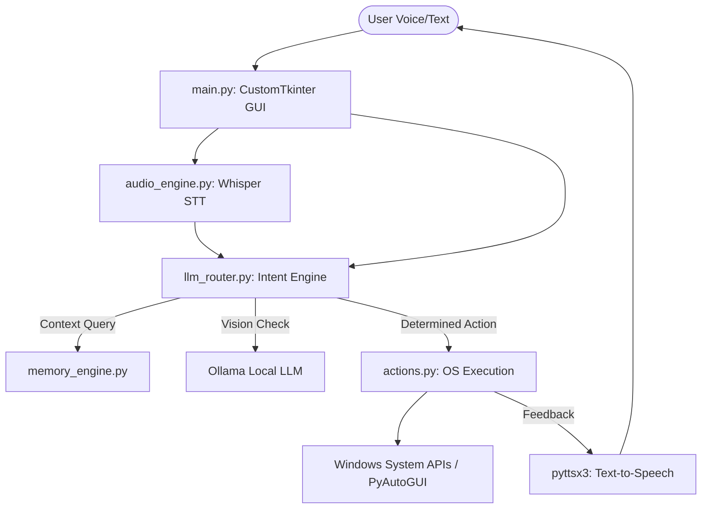

# Offline Accessibility AI Desktop Agent — Complete Project Documentation

## 1. Abstract
The **Offline Accessibility AI Desktop Agent** is a sophisticated, voice-controlled, and privacy-first digital assistant designed to execute complex desktop workflows without relying on cloud APIs. Built entirely in Python and powered by local Large Language Models (LLMs) via Ollama, it provides an intelligent bridge between natural language commands and underlying Windows OS actions. With its modern "Midnight Black and Neon" CustomTkinter UI, robust vision-based screen interaction capabilities, and continuous memory engine, the agent serves as an accessible, hands-free interface for navigating the digital environment.

---
 
## 2. Introduction
Traditional virtual assistants (like Cortana, Siri, or Alexa) require constant internet connectivity, risking privacy and introducing latency. This project aims to bring the intelligence of modern LLMs (like Gemma, Llama 3) directly to the local machine. By combining Speech-to-Text (STT) parsing, deep semantic intent routing, and dynamic PyAutoGUI automation, this agent can read the screen, type messages, open applications, manage files, set alarms, and answer questions entirely offline.

---

## 3. Core Features

### 3.1. Voice and Natural Language Control
- **Wake Word Activation:** Continuously listens for wake words ("Computer", "Assistant") using a low-overhead audio stream before processing the full command using Whisper STT.
- **Semantic Intent Routing:** Instead of rigid regex matching, commands are passed to a local LLM that determines the *intent* (e.g., "turn up the music" → `volume_up`).
- **Conversational Memory:** Remembers past context, allowing for follow-up questions and pronoun resolution ("Open Chrome", then "Close it").

### 3.2. System and Desktop Automation
- **Application Management:** Launch any application or folder using multi-strategy fallback (Start Menu indexing, PATH searching, PowerShell execution). 
- **Media & Movie Playback:** Say "Play movie Inception", and the agent scans the `Documents/movie` folder, uses the LLM to fuzzy-match your request against actual video files, and plays the closest match in the default Windows player.
- **Hardware Control:** Control volume, brightness, and check battery life.
- **Power Management:** Lock screen, sleep, shutdown, or restart the PC with voice commands.
- **Information Retrieval:** Get time, date, WiFi status, disk space, and top running processes.

### 3.3. Artificial Intelligence & Vision
- **Screen Analysis:** "What's on my screen?" The agent takes a secure, local screenshot and passes it to an LLM to describe the visual context (active apps, reading code, etc.).
- **Smart Screen Interaction:** "Click the play button" or "Type hello there". The agent uses a two-pass vision pipeline to locate UI elements on the screen and interact with them using PyAutoGUI.
- **Total Recall Memory Engine:** Continuously logs interactions to build a long-term context file, providing the LLM with behavioral history.

### 3.4. Premium User Interface
- Built with **CustomTkinter**, the agent features a sleek **Midnight Black and Neon** color palette (`#000000` backgrounds, neon cyan and purple accents) designed for low eye strain and a modern, high-tech aesthetic.
- Features a live transcript, LLM health indicators, and a background alarm daemon that pushes notifications to the UI.

---

## 4. System Architecture

The project is designed with a modular, decoupling architecture, allowing different engines to work asynchronously:



---

## 5. Detailed Module Implementation & Explanation

### 5.1. `main.py` (The Orchestrator)
This is the entry point. It initializes the **CustomTkinter** graphical interface. 
- **Role:** Handles the event loop, creates the deep black/neon UI components, and spawns background daemon threads (like `_alarm_daemon` to check for due timers, and `_llm_health_daemon` to monitor Ollama status).
- **Execution Flow:** Captures text input or voice callbacks and routes them immediately to `llm_router.py`.

### 5.2. `llm_router.py` (The Brain)
Handles all communication with the local Ollama instance (`http://localhost:11434`).
- **Context-First Routing:** Injects the system prompt and available actions. It parses the user's string and forces the LLM to output a strict JSON format containing `{"action": "...", "target": "..."}`.
- **Vision Pipeline:** If the user asks to interact with the screen, `find_element_on_screen` is called. It sends a base64-encoded screenshot to the vision model to retrieve `(x, y)` percentage coordinates for mouse clicking.
- **Smart File Matching:** Contains `match_movie_filename()`, a specialized LLM call that takes a user's messy voice input (e.g., "play avon-gers") and a list of actual files (`avengers_endgame_1080p.mp4`) and returns the exact match.

### 5.3. `actions.py` (The Hands)
A massive library of over 50 executable OS commands.
- **Implementation:** Uses `pyautogui` for mouse/keyboard automation, `subprocess` / `ctypes` for interacting with Windows deep APIs (e.g., emptying the recycle bin, altering brightness via WMI), and `psutil` for hardware diagnostics.
- **Safety:** Contains `is_destructive_action()` checks to ensure the agent asks for confirmation before shutting down the PC or deleting files.

### 5.4. `audio_engine.py` (The Ears and Mouth)
- **STT (Speech-to-Text):** Uses OpenAI's **Whisper** model locally for highly accurate transcription of audio buffers. Implements Voice Activity Detection (VAD) to know when the user stops speaking.
- **TTS (Text-to-Speech):** Uses the lightweight `pyttsx3` library for instant, zero-latency voice responses.

### 5.5. `memory_engine.py` (The Hippocampus)
Maintains `agent_log.txt` and `agent_memory.txt`.
- **Implementation:** Intercepts every user query and agent response, writing raw logs instantly. In a background thread, it can prompt the LLM to extract new factual knowledge to update the permanent memory state.

---

## 6. Installation & Setup Prerequisites

### System Requirements
- **OS:** Windows 10/11
- **Python:** 3.10 or higher
- **Hardware:** 16GB+ RAM recommended (for running large local models), Microphone.
- **Software:** [Ollama](https://ollama.com/) must be installed.

### Setup Steps
1. **Clone the Repository** and navigate to the directory:
   ```cmd
   cd Miniproject_implementation
   ```
2. **Create a Virtual Environment**:
   ```cmd
   python -m venv .venv
   .venv\Scripts\activate
   ```
3. **Install Dependencies**:
   ```cmd
   pip install -r requirements.txt
   ```
4. **Pull Local Models** (Ensure Ollama is running in the background):
   ```cmd
   ollama pull gemma4
   ```
5. **Run the Application**:
   ```cmd
   python main.py
   ```

---

## 7. Project File Structure

```text
Miniproject_implementation/
│
├── main.py              # Main GUI application and threading logic
├── actions.py           # Core execution library (OS APIs, PyAutoGUI)
├── llm_router.py        # Intent parsing, Ollama API integration,Vision
├── audio_engine.py      # Whisper STT and pyttsx3 TTS
├── memory_engine.py     # Session logging and memory management
├── diagnostics.py       # Pre-flight startup checks
├── settings_manager.py  # User settings handler
├── requirements.txt     # Python package dependencies
│
├── .venv/               # Virtual environment (ignored in git)
├── agent_memory.txt     # Persistent AI memory context
├── alarms.json          # Scheduled alarms storage
├── user_settings.json   # Preferences (wake words, model choice)
└── run_agent.bat        # Windows quick-launch script
```

---

## 8. Conclusion and Future Scope
This project successfully demonstrates that a high-functioning, vision-capable desktop assistant can be built entirely locally without sacrificing user privacy or paying for cloud API calls. 

**Future Enhancements:**
1. **Advanced Vision:** Integrating stronger multi-modal models (like Llama 3 Vision) for even more accurate UI coordinate grounding.
2. **Workflow Automation:** Allowing users to say "Create a macro that does X, Y, and Z" and having the agent write its own temporary Python scripts to execute the workflow.
3. **Cross-Platform:** Adapting `actions.py` to support macOS (`osascript`) and Linux (`xdotool`).
